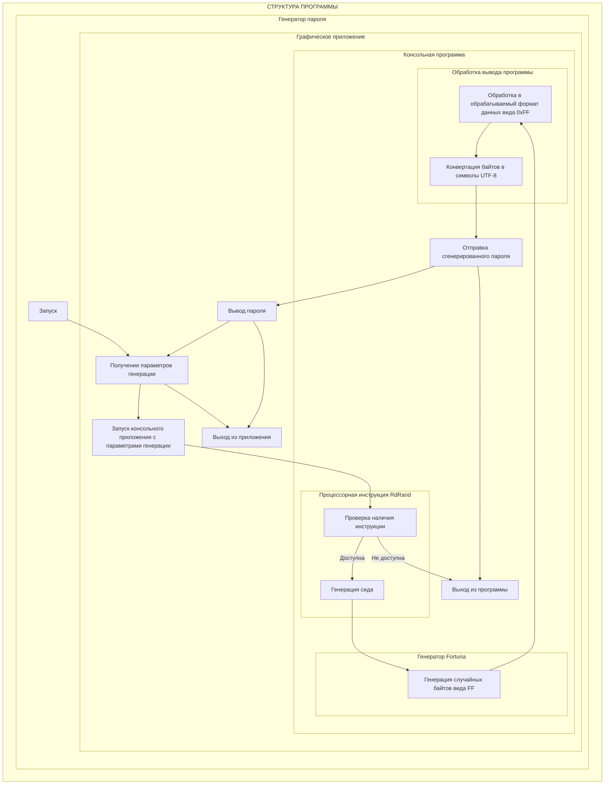

# Генератор пароля

### Системные требования
  - *Процессор*: Intel 3-го поколения / AMD Ryzen или новее.  
  - *Операционная система*: Windows 10 или новее.
  - *Дополнительное програмное обеспечение*: Windows Subsystem for Linux.

### Выполнено
1. Проверка наличия процессорной инструкции *RdRand*
2. Генерация сида при помощи *RdRand*
3. Генерация криптографически защищенных случайных байтов при помощи алгоритма *Fortuna* 
4. Перевод байтов в *UTF-8* символы 
5. ...

### Структура программы

